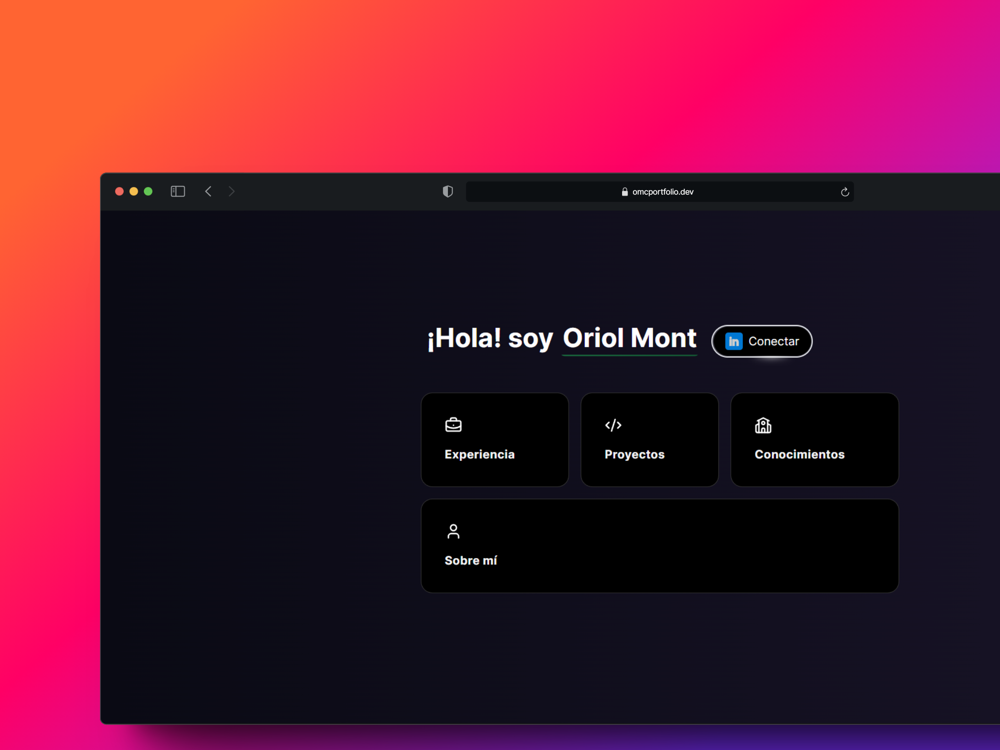
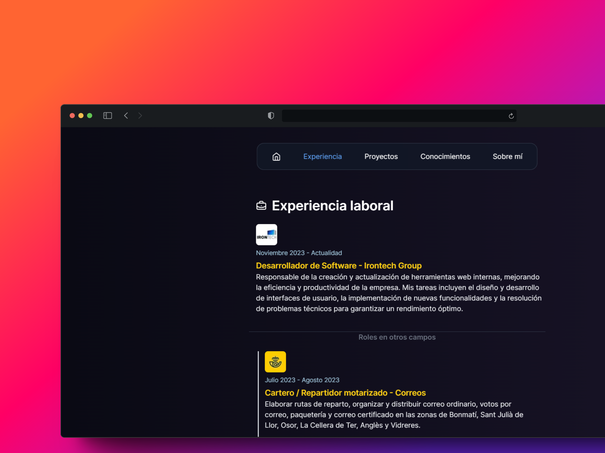

# Portfolio with Next.js + Tailwind 🚀

This portfolio is built using Next.js and styled with Tailwind CSS. It showcases the following: about me, projects, experiences, technologies, education, and certifications.




## Table of Contents 📚

### English

- [Getting Started](#getting-started-)
- [Learn More](#learn-more-)

### Español

- [Empezando](#empezando-)
- [Aprende Más](#aprende-más-)

- [Credits](#créditoscredits-)

## English 🇬🇧

### Getting Started 🚀

To start the development server:

```bash
npm run dev
# or
yarn dev
# or
pnpm dev
# or
bun dev
```

Open [http://localhost:3000](http://localhost:3000) in your browser to see the result.

You can start editing the page by modifying `app/page.tsx`. The page auto-updates as you edit the file.

This project uses [`next/font`](https://nextjs.org/docs/basic-features/font-optimization) to automatically optimize and load Inter, a custom Google Font.

### Learn More 📖

To learn more about Next.js, check out the following resources:

- [Next.js Documentation](https://nextjs.org/docs) - learn about Next.js features and API.
- [Learn Next.js](https://nextjs.org/learn) - an interactive Next.js tutorial.

## Español 🇪🇸

### Empezando 🚀

Para iniciar el servidor de desarrollo:

```bash
npm run dev
# o
yarn dev
# o
pnpm dev
# o
bun dev
```

Abre [http://localhost:3000](http://localhost:3000) en tu navegador para ver el resultado.

Puedes comenzar a editar la página modificando `app/page.tsx`. La página se actualiza automáticamente a medida que editas el archivo.

Este proyecto utiliza [`next/font`](https://nextjs.org/docs/basic-features/font-optimization) para optimizar y cargar automáticamente Inter, una fuente personalizada de Google Font.

### Aprende Más 📖

Para aprender más sobre Next.js, consulta los siguientes recursos:

- [Documentación de Next.js](https://nextjs.org/docs) - aprende sobre las características y la API de Next.js.
- [Aprende Next.js](https://nextjs.org/learn) - un tutorial interactivo de Next.js.

## Créditos/Credits 💼

- **Lucide Icons**: [Visit Lucide Icons](https://lucide.dev)
- **AceternityUI**: [Visit AceternityUI](https://ui.aceternity.com/)
- **Inspiración/Inspiration**: [Visit portfolio.dev](https://porfolio.dev/).

Agradecimientos especiales a los creadores y contribuyentes de estos recursos por facilitar el desarrollo de este proyecto.

Special thanks to the creators and contributors of these resources for facilitating the development of this project.
